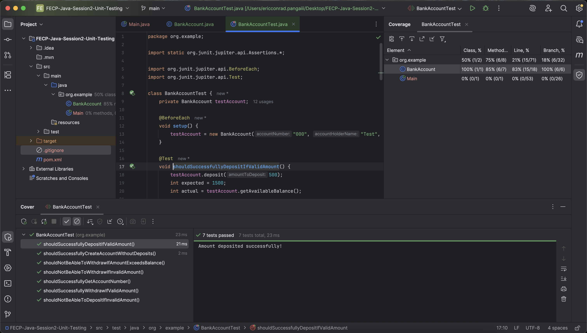
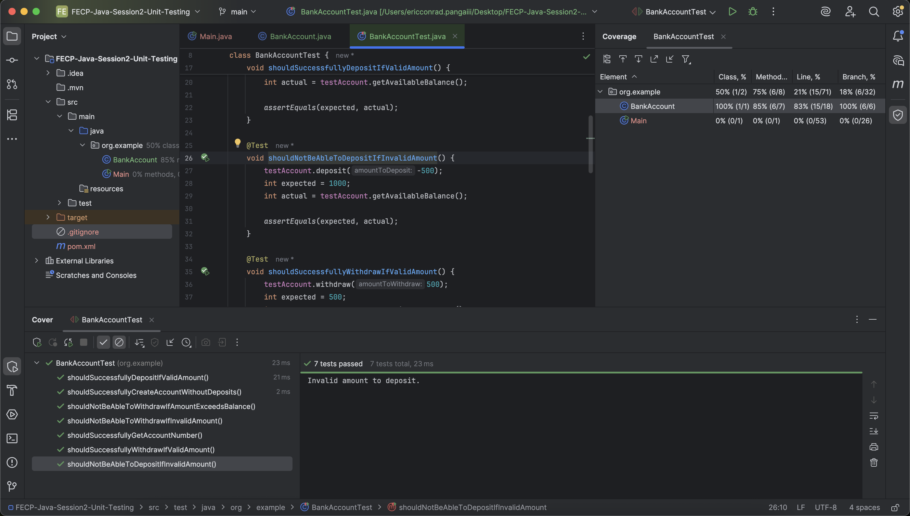
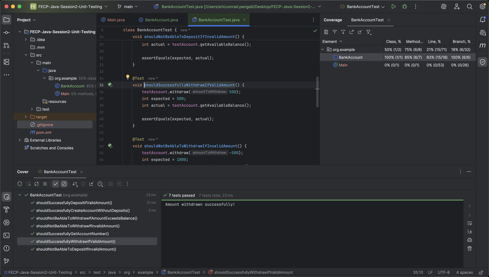
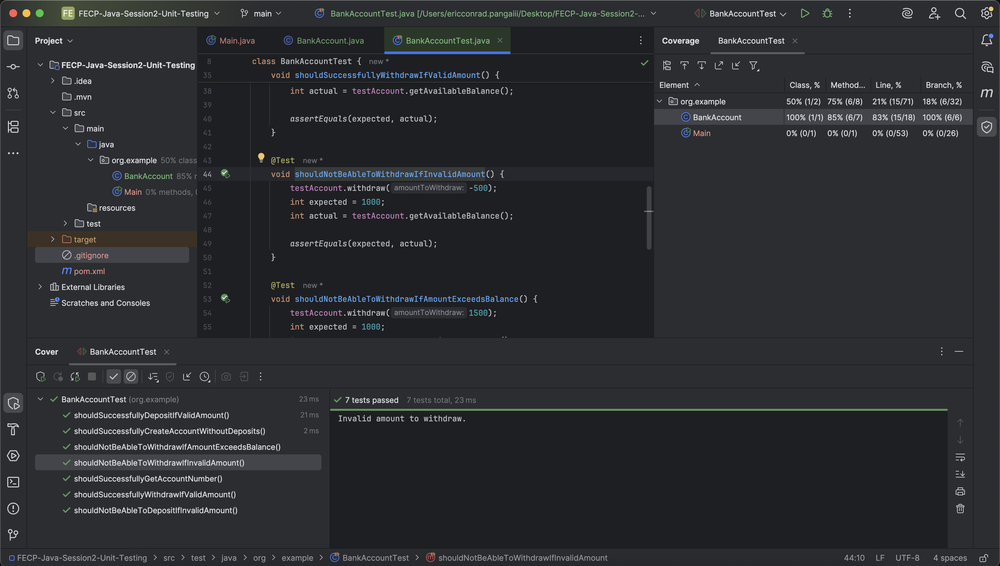
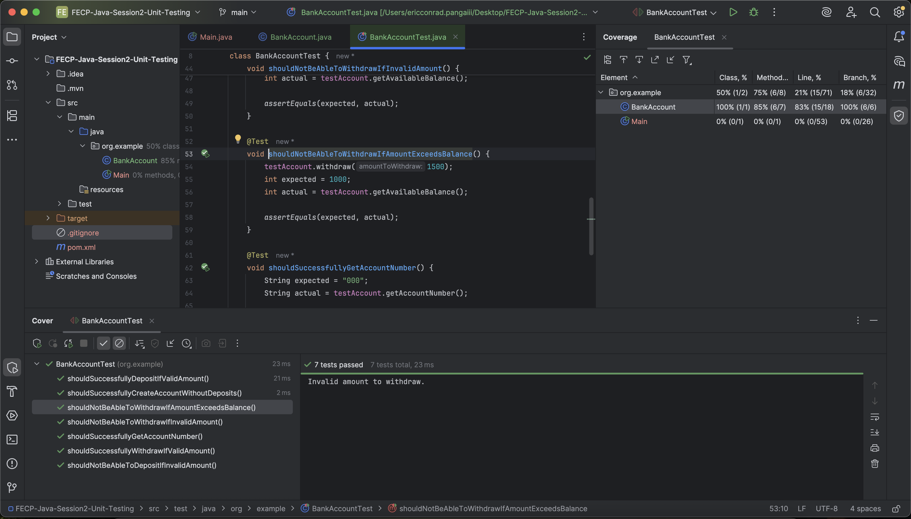
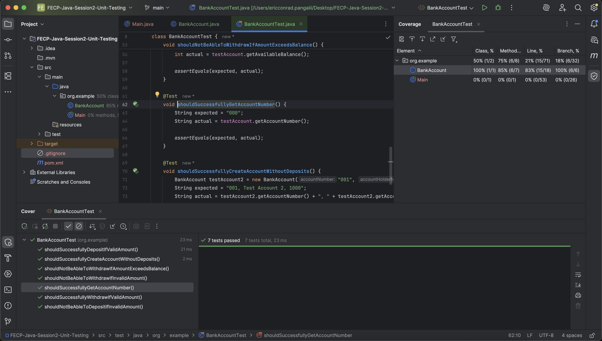
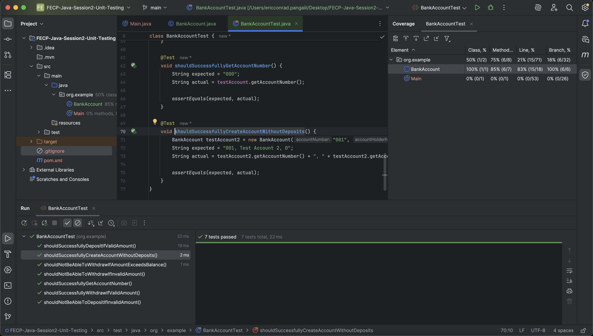

# FECP-Java-Session2-Unit-Testing

## Lab 2: Unit Testing

## Eric Conrad Panga

## Screenshots of Output

### Deposit a valid amount

### Deposit an invalid amount

### Withdraw a valid amount

### Withdraw an invalid amount

### Withdraw an amount that exceeds the balance

### Test the getAccountNumber() method

### Test creation of Bank Account without deposits

### Test case coverage

